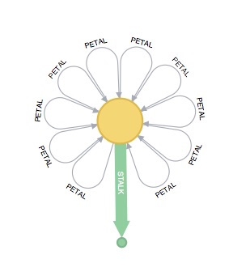

= Bloom documentation

== Versioning

This documentation set only exists in its latest version, `current`, which matches the latest release of the product.
Any work to go into already published content should be raised against the `main` branch.
Any work for the next release can be raised against the `dev` branch and cherry-picked to `main` when ready for release.

== Generating HTML output

To convert the asciidoc source to HTML:

----
npm run build
----

== Viewing HTML output

To view the built site, launch a local server:

1. `npm start`
2. In a browser tab, go to `localhost:8000`

== Publishing content

Newly added content is **not** published automatically when a PR is merged.
Publication needs to be manually triggered on TeamCity.

